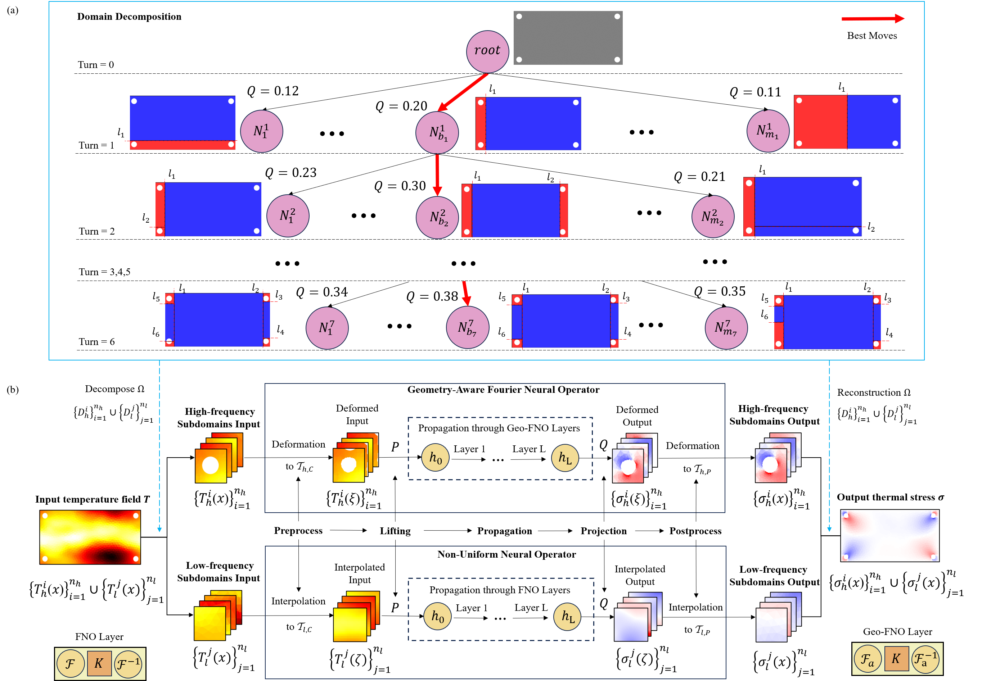

# Rapid Prediction of Thermal Stress on Satellites via Domain Decomposition-based Hybrid Fourier Neural Operator

This repository contains code for the paper [Rapid Prediction of Thermal Stress on Satellites via Domain Decomposition-based Hybrid Fourier Neural Operator](https://doi.org/10.1016/j.engappai.2025.110826).



## Installation

Using conda and the environment.yml file:

```
conda env create --name HFNO --file=environment.yml
conda activate HFNO
```

## A Quick Start

### Domain Decomposition
To divide the domain, use the following command:

```
python experiment/domain_decomposition/decomposition.py --PATH 'data/data_case1.npy' 
--variable 'sigma_xy_2d' 
--num_sims 3000 
--num_dataset 5 
--NUM_TURNS 6 
--filename 'result/saved_KDtree/KDtree.npy' 
```


### Train
```
python train.py --PATH 'data/data_case3.npy'  
--PATH_kdtree 'result/saved_KDtree/KDTree_3.npy'
--saved_model 'result/saved_model/model.pt' 
--variable 'sigma_xy_2d' 
--epochs 201 
--wandb False
```

### Test
```
python evaluate.py --PATH 'data/data_case3.npy'  
--PATH_kdtree 'result/saved_KDtree/KDTree_3.npy' 
--saved_model 'result/saved_model/model3.pt' 
--variable 'sigma_xy_2d'
```


This work is built on top of other open source projects, including [Fourier Neural Operator with Learned Deformations for PDEs on General Geometries (GEO-FNO)](https://github.com/NeuralOperator/Geo-FNO), and [NUNO: A General Framework for Learning Parametric PDEs with Non-Uniform Data (NU-FNO)](https://github.com/thu-ml/NUNO/). We thank the original contributors of these works for open-sourcing their valuable source codes. 

## Contact Us
For any questions or issues, you are welcome to open an issue in this repo, or contact us at zhoukangruinudt@163.com, and wendy0782@126.com.
